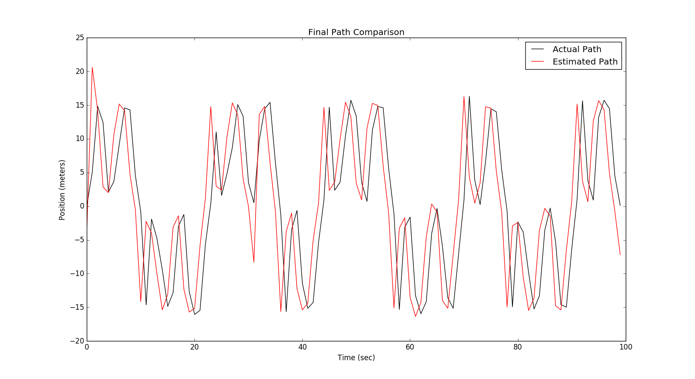
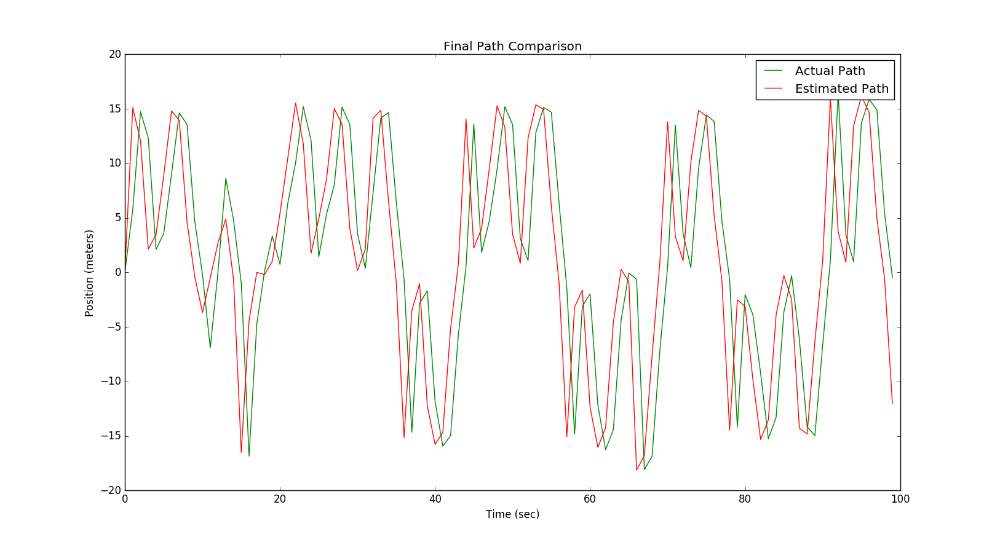
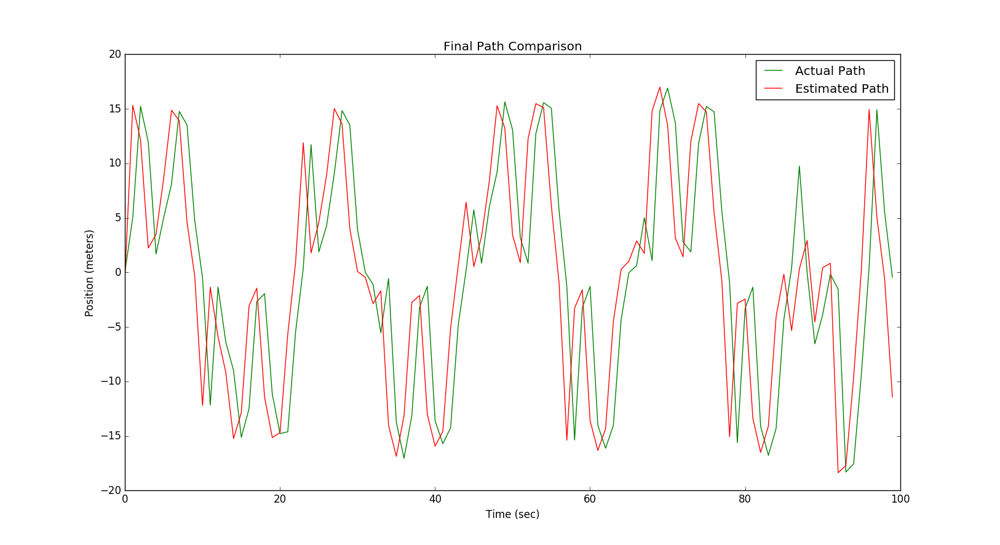

# Localization
Implementation of filters for Mobile Robot Localization 

## Usage

- Install the requirements using
```bash
sudo pip install -r requirements.txt
```
- Run Kalman Filter as follows
```bash
$ python main.py --filter Kalman
```
- For the complete list of options, run
```bash
$ python main.py --help
```

## Contents

- [Kalman Filter](#kalman)
- [Particle Filter](#particle)

<a name='kalman'></a>
### Kalman Filter

**Fig 1**: Original path of motion


**Fig 2**: Comparison of motion from different view points. The filter used to smoothen the data is done by Savitzky-Golay filter by fitting a 3rd degree polynomial on a window of size 20.


**Fig 3**: Comparison of data distribution as a function of time of flight of motion. 

<a name='particle'></a>
### Particle Filter


**Fig 1** Particle filter with particles of size 10


**Fig 2** Particle filter with particles of size 100


**Fig 3** Particle filter with particles of size 500


## To-do
- [x] Kalman Filter
- [x] Particle Filter
- [ ] Histogram Filter
- [ ] Benchmarking the filters

